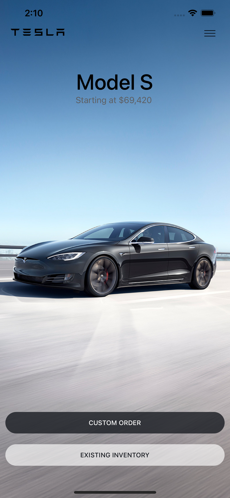

<h1> 
    🚗 Tesla Clone App using React Native 
<h1>

> 🏠 Tesla App using React Native

<!--  -->


#### To install locally

1. Clone repo on your local machine:

```js
 git clone
```

Install server-side dependencies:

```js
 cd TeslaClone
 npm install
```

Now to start the app

```js
 npm start / expo start
```
